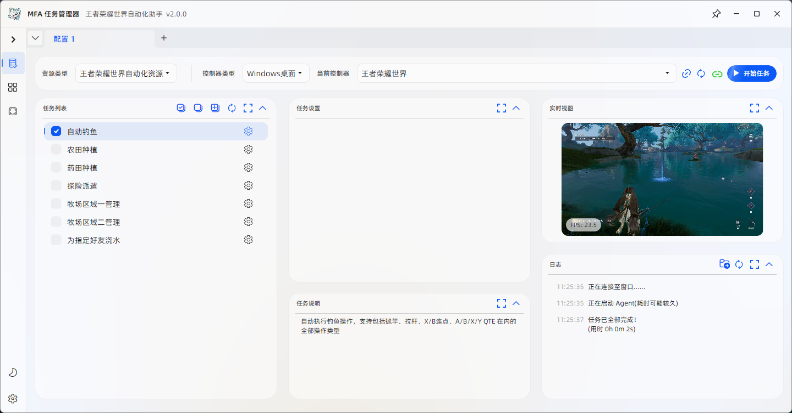
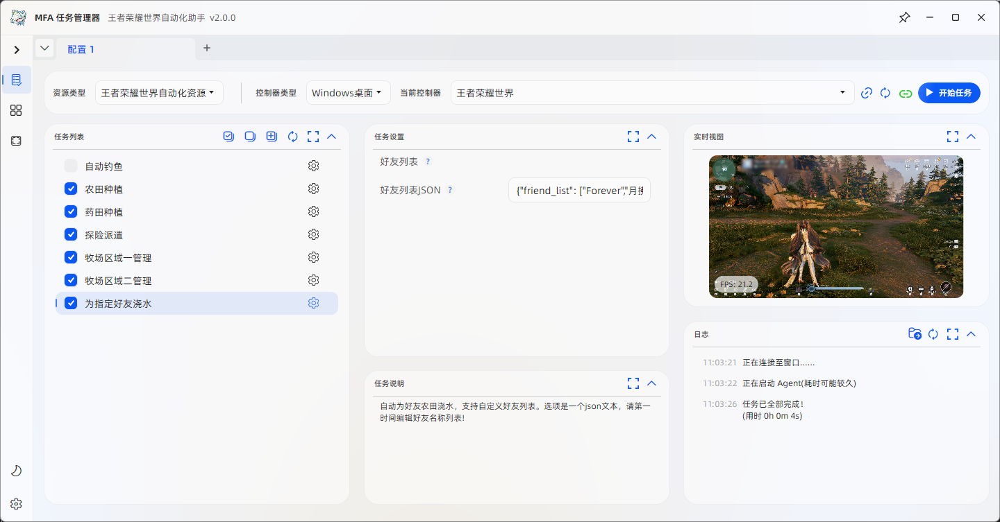

<!-- markdownlint-disable MD033 MD041 -->
<p align="center">
  
</p>

<div align="center">

# MaaHKWorld - 王者荣耀世界游戏助手

</div>

基于 [MaaFramework](https://github.com/MaaXYZ/MaaFramework) 开发的王者荣耀世界游戏助手，目前已实现自动钓鱼以及探险派遣、药田种植、农场种植、牧场管理在内的家园玩法。

## 特性

- 基于图像识别的自动化操作
- 仅支持后台运行（窗口伪最小化）
- 使用虚拟手柄绕过游戏键鼠屏蔽
- 利用游戏内摇杆准星与系统光标坐标同步的机制，实现反向控制摇杆准星精准定位


## 重要提示

游戏本身的机制会使画面内摇杆准星与系统物理鼠标的光标坐标始终保持一致并互相影响，因此在任务执行过程中：

1. 需保持游戏窗口处于后台状态；
2. 鼠标光标会随着游戏画面内准星移动，不要操作鼠标，放一边等着就好。

否则除自动钓鱼以外的家园玩法任务将无法正常运行！

第一次使用这个框架，都是自己摸索着来，不足之处难免。有问题、需求的话欢迎提交 issue 讨论，共同完善这个项目！

## 快速开始

### 前置要求

1. **Python 3.8+** - [下载地址](https://www.python.org/downloads/)
2. **ViGEmBus 虚拟手柄驱动** - [下载地址](https://github.com/ViGEm/ViGEmBus)（安装后重启电脑）

### 下载与启动

1. 从 [Releases](https://github.com/letmebe/HKWorld/releases) 下载最新版本 `MaaHKWorld-win-x86_64-*.zip`

2. 解压后运行 **`DependencySetup_依赖库安装_win.bat`** 安装MFAAvalonia运行所需的依赖如 .NET Desktop Runtime、Visual C++ Redistributable。

3. 启动游戏，注意一定要将游戏分辨率设置为 1920x1080 ，当前所有模板和匹配区域均基于此分辨率，在其它分辨率情况下无法正常工作!

4. 双击 **`启动王世界助手.bat`** 启动 MFAAvalonia。 首次运行会自动：
   - 创建虚拟环境 `venv/`
   - 安装 `maafw`, `vgamepad`, `pywin32` 等 agent_server 运行所需依赖
   - 在当前用户桌面上创建指向本脚本的快捷方式，之后直接从桌面启动即可

#### 自动钓鱼

1. 启用鱼竿后进入钓鱼场景，注意确保鱼饵充足，水面背景干净文字清晰，尤其要保证右下角的抛竿等指令区域不能有干扰（类似下图所示）：


2. 在 MFAAvalonia 中只选择任务 "自动钓鱼"，点击 **开始任务** ，会看到任务栏中游戏窗口图标被激活，延时片刻后游戏内角色开始自动钓鱼，支持包括抛竿、拉杆、X/B连点、A/B/X/Y QTE 在内的全部操作类型。


4. 钓鱼过程中尽量使游戏保持前台或后台其中一种状态，切勿在游戏画面中点击鼠标，否则输入会从虚拟手柄切换回鼠标，且再次切出画面时窗口焦点丢失，造成角色不再动作。如果遇到这种情况，可以点击 MFAAvalonia 的 **停止任务** ，然后点击 **开始任务** 重新开始钓鱼。

#### 家园玩法

1. 在 MFAAvalonia 中选择所需的任务，点击 **开始任务** ，已选任务会依次执行，其间注意事项见上文！


2. 探险派遣任务选项是一个json文本，包括三个地点，每个地点对应三个人员，自定义时一定要保证人员在每个地点的出场顺序与选择菜单内顺序一致，都是自上而下的！

3. 药田种植选项中的药草名称只在游戏中未选取药草种类时（右下角显示小人参，而非之前种植的类型）才会应用，属于保底选项。正常情况下默认为你上次种植的类型，如需修改请事先在游戏内自行配置。

4. 农场种植选项中的作物名称只在游戏中未选取作物种类时（右下角显示小禾苗，而非之前种植的类型）才会应用，属于保底选项。正常情况下默认为你上次种植的类型，如需修改请事先在游戏内自行配置。

5. MFAAvalonia 会自动保存修改后的选项，无须每次执行前都操作。需要修改预置选项时，请编辑 `MFAAvalonia/interface.json 中 option 下对应任务的参数节点。

6. 如果有自动定时运行的需要，可以在 MFAAvalonia - 设置 - **定时执行** 中设定时间，届时会自动运行已选任务。建议长时间挂机时再使用这个功能，否则会干扰电脑正常工作————突然窜出来跟你抢鼠标😂。


## 已知问题

1. 摇杆控制角色移动的幅度有随机性，有时会出现漏植、漏浇的现象，当前默认参数已经是我多次测试的最优值，不建议自行修改。

2. 角色都是机械向前移动，按行处理，所以如果你的田地格子不满路径上踩不到，就只能加油升级了！

3. 牧场管理暂时只到区域二，因为我还没钱开区域三，无法测试……

4. 为指定好友浇水功能只支持农田浇水，药田离传送点太远不好定位，以后再说吧。

## 开发

### 项目结构

## 项目结构

```
MaaHKWorld/
├── agent/                      # 自定义扩展
│   ├── agent_server.py         # Agent 服务注册
│   ├── custom_action.py        # 虚拟手柄控制、窗口激活
│   ├── fishing_recognition.py  # 多模板匹配识别器（灰度图优化）
│   ├── fishing_action.py       # 识别结果处理动作
│   ├── logger.py               # 统一日志模块（按日期轮转）
│   └── logs/                   # 运行日志（自动清理）
├── assets/
│   ├── resource/
│   │   ├── image/              # 图像模板
│   │   ├── model/ocr/          # OCR 模型（由CI自动配置）
│   │   └── pipeline/           # Pipeline 配置
│   ├── MaaCommonAssets/        # OCR 模型 submodule
│   └── interface.json          # 项目配置
├── tools/                      # CI/CD 工具
│   └── install.py              # CI 安装脚本（路径自动适配）
├── venv/                       # Python 虚拟环境（自动创建）
├── 启动王世界助手.bat          # 启动脚本（自动配置环境）
└── requirements.txt            # Python 依赖
```

## 配置说明

### 控制器配置 (interface.json)

当前配置支持后台运行：

| 配置项 | 值 | 说明 |
|--------|-----|------|
| screencap | FramePool | 极快，支持后台截图 (Win10 1903+) |
| mouse | SendMessage | 支持后台输入，当前游戏未使用 |
| keyboard | SendMessage | 支持后台输入，当前游戏未使用 |

### 平台支持

当前仅支持 **Windows x86_64**，其他平台构建已禁用。

## 开发

### 本地开发

```bash
# 安装依赖
pip install -r requirements.txt

# 初始化 submodule
git submodule update --init --recursive
```

### 发布版本

```bash
# 提交代码
git add .
git commit -m "feat: 新功能"
git push

# 创建 tag 触发 CI 构建
git tag v1.0.0
git push origin v1.0.0
```

CI 会自动打包 MFAAvalonia + 项目资源并发布到 Releases。

## 常见问题

### Q: 找不到游戏窗口
A: 确保游戏已启动，窗口标题包含 "王者荣耀世界"

### Q: Agent 连接失败
A:
1. Agent 由 interface.json 自动启动
2. 检查 Python 环境：`venv/Scripts/python.exe`

### Q: 虚拟手柄不工作
A: 需要安装 ViGEmBus 驱动并重启，正常情况下MFAAvalonia开始任务后，右下角托盘区域会出现Xbox360控制器图标，听到设备连接的提示声。

### Q: 识别失败
A:
1. 检查图像模板是否正确
2. 查看日志：`MFAAvalonia/agent/logs`

## 技术栈

- [MaaFramework](https://github.com/MaaXYZ/MaaFramework) - 自动化框架
- [vgamepad](https://github.com/yshrd/vgamepad) - 虚拟手柄
- [MFAAvalonia](https://github.com/MaaXYZ/MFAAvalonia) - 通用 UI

## 文档

- [开发指南](DEVELOPMENT.md) - 开发环境、架构说明、开发复盘

## 鸣谢

本项目由 **[MaaFramework](https://github.com/MaaXYZ/MaaFramework)** 强力驱动！

感谢以下开发者对本项目作出的贡献：

[](https://github.com/MaaXYZ/MaaFramework/graphs/contributors)

## 许可证

MIT License
